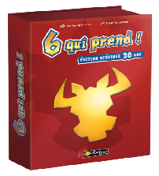
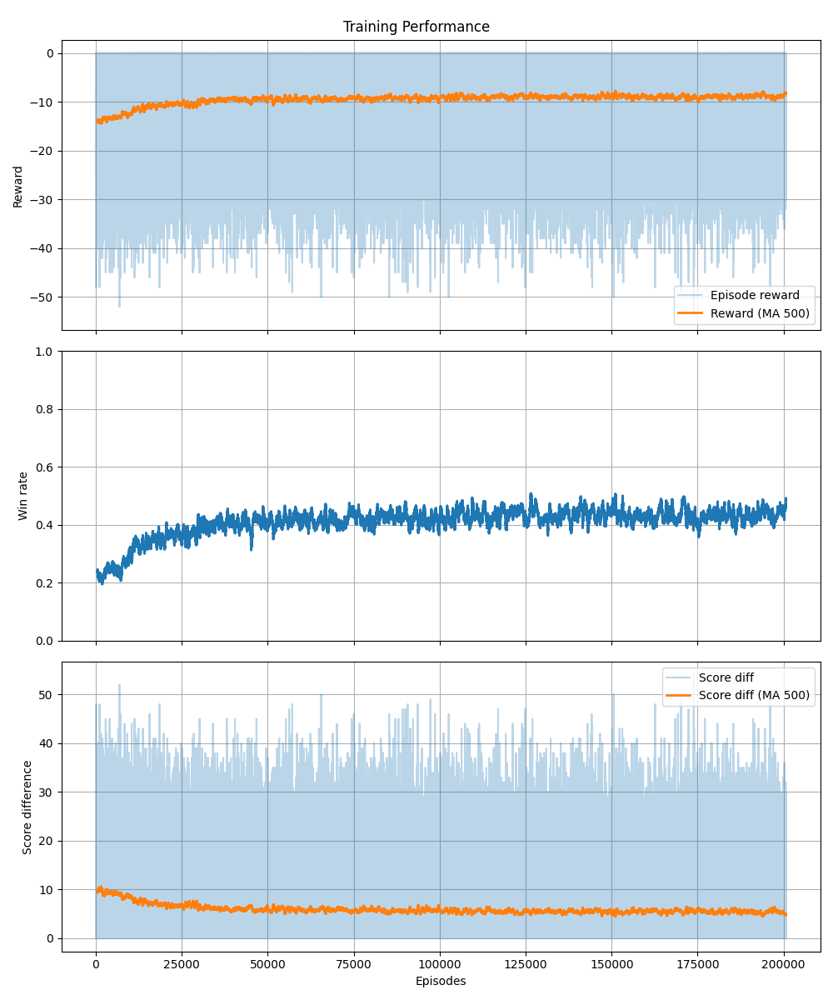

# six-take

## Project Overview

Six-Takes (or Six qui prend) is a card game designed for 3-10 players, where the objective is to avoid collecting penalty cards. Player choose cards to play each round, stacking their choices, and when placing the sizth card on a stack, the stack resets and they collect those penalties. A good player would need to consider the stacks on the table, the cards in their hand, and the potential moves of their opponents.

I build a slightly simplified Gymnasium environment to simulate the game, and train reinforcement learning agents using Stable Baselines3 to play against various rule-based opponents. The goal is to create an agent that can effectively minimize penalty points over multiple rounds of play.

Note: The simplification i made was to remove the choice of stack to wipe when placing a global low card. Instead, the stack that is wiped is always the one with the lowest total value. This was done to reduce the action space and complexity for the RL agent. In the real game though, players can strategically choose to take a stack that will give them more penalty point if it forces a another player to take an even worse stack on that same turn.

## Primary Focus

- Implementing a Gymnasium environment for Six-Takes.
- Creating various simple rule-based agents.
- Training reinforcement learning agents using Stable Baselines3.
- Evaluating agent performance against different opponent strategies.
- Use CI/CD pipelines with github actions for testing and deployment.

## Gymnasium Environment Design

### Observation Space

The observation space is a dictionary containing:
- round: The current round number (0-10).
- hand: The agent's current hand of cards (1-10 cards, with the missing filled with -1s).
- stacks: The current state of the 4 stacks on the table (each stack can have up to 5 cards, with missing cards filled with -1s).
- stack_sizes: The current sizes of each stack (number of cards in each stack).
- unseen_cards: A one-hot encoded vector representing which cards (1-104) have not yet been seen yet by the agent.
- own_history: the agent's own card play history for this set of rounds (10 cards, with missing filled with -1s).
- opponent_history: the card play history of all opponents for this set of rounds (9 opponents x 10 cards, with missing filled with -1s).
- own_score: the agent's current score (penalty points).
- opponent_scores: the current scores of all opponents (9 opponents).

I chose these elements specifically the give the agent the information to potentially build complex strategies around stack management, and predicting opponent behavior based on their play history, and revealed cards.

### Action Space

The action space is just a single discrete value representing the index of the card in the agent's hand to play (0-9). As cards are played, the action space is masked to only allow valid plays (i.e., cards that are still in the agent's hand).

### Reward Function

Many different reward functions were considered and experimented with. The final reward function used was:
**At the end of each round, the agent receives a negative reward equal to the penalty points it collected that round.**

This should be effective in encouraging the agent to minimize its penalty points over the course of the game.
I did consider other heuristics to potentially improve training speed, but eventually decided to keep it simple and let the model learn from the core objective of minimizing penalty points, which is the ultimate goal of the game.

## Simple Agent Designs

- RandomAgent: Chooses a random valid card from its hand.
- SmallChoiceAgent: Always plays the smallest valid card in its hand.
- LargeChoiceAgent: Always plays the largest valid card in its hand.

## RL Training Design

- Algorithm: Proximal Policy Optimization (PPO) with MaskablePPO from sb3-contrib to handle action masking.
- Training Environment: every 5000 steps, choose a scenario with different opponent agents to train against:
    - 3 best PPO model opponents
    - mixed opponents (Random, SmallChoice, PPO)
    - all small opponents (SmallChoiceAgent)
    - 2 PPO, 1 small opponent
    - all random opponents (RandomAgent)
- trained the model for 2 million timesteps, saving checkpoints every 100,000 steps.

- Evaluation: After training, the agent is evaluated against each scenario for 1000 games, recording average penalty points and win rates.

## Training Results

I trained the PPO agent for 2 million timesteps. The learning curves above show the average reward over time (negative from penalty points), the winrate over time (percentage the agent won the 4 player set of rounds), and the score difference over time (the agent's score minus the winner's score).

In the first 50,000 timesteps, we can see clear improvements in all metrics, in particular the winrate increasing from 0.2 (worse than random) to about 0.4. After that, however, the performance plateaus and stays around 0.4 winrate for the rest of the epochs.